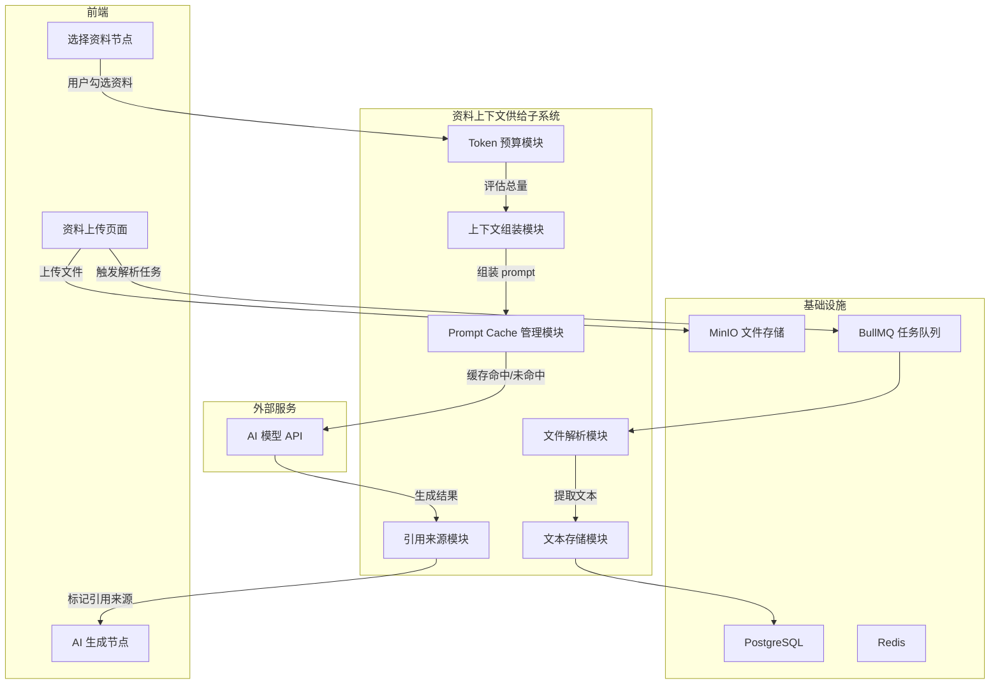
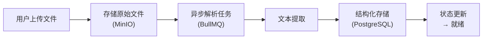
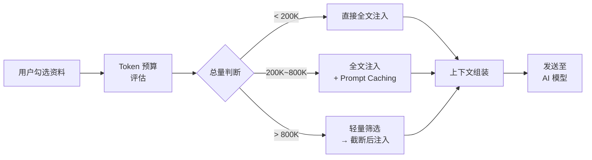
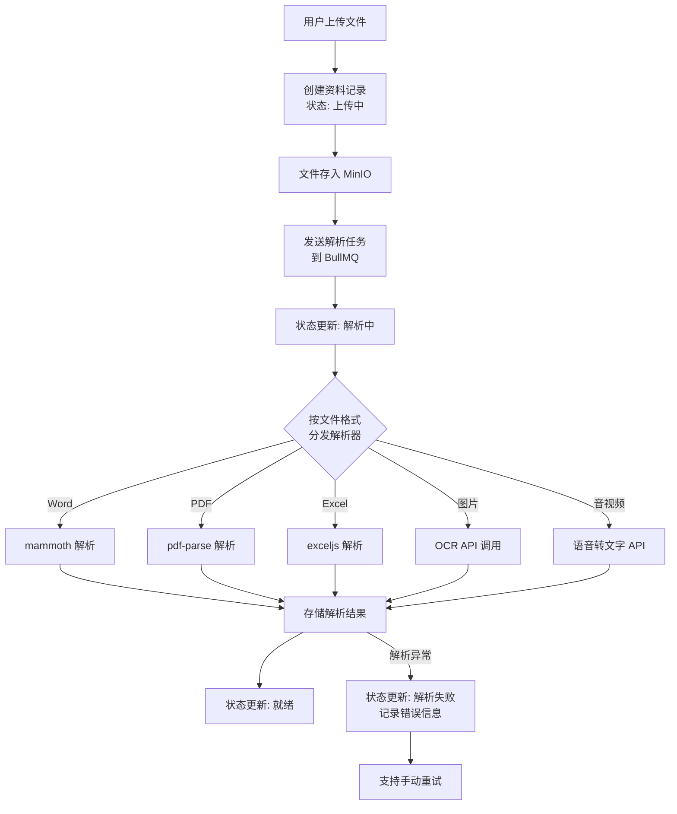
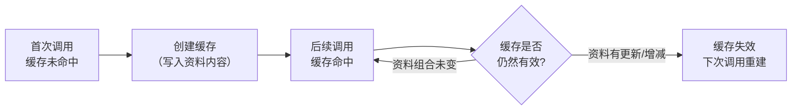
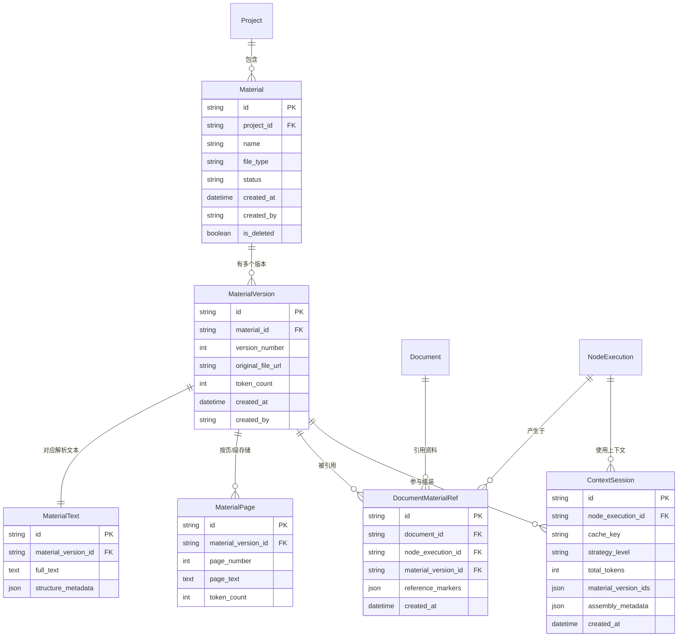

# 资料上下文供给子系统 — 技术方案文档

> 项目：AI 文档生成平台
> 状态：技术方案决策（系统设计前）
> 最后更新：2026-03-18

---

## 一、文档概述

### 1.1 目的与范围

本文档针对 AI 文档生成平台中的**资料处理与上下文供给**子系统，记录技术方案选型、核心设计思路和关键决策，作为后续系统设计阶段的输入。

**范围包括：**

- 项目资料库的文件上传与解析
- AI 生成流程中参考资料的上下文供给策略
- Prompt Caching 机制设计
- 引用来源追溯机制
- 相关数据模型概要

**范围不包括：**

- AI 模型调用与多模型编排（属于 AI 调用子系统）
- 流程引擎与节点状态管理（属于流程引擎子系统）
- 信息脱敏/恢复机制（属于安全子系统）
- 文档导出与排版（属于导出子系统）

### 1.2 关联需求

本文档基于 `requirements-outline-v2.md` 中的以下章节：

| 需求章节 | 内容 | 关联 |
|---------|------|------|
| 2.2.4 项目资料库 | 资料上传、自动解析、RAG 处理、版本管理、回收站 | 直接覆盖 |
| 节点② 选择资料 | 资料库浏览、勾选、跨项目引用、RAG 检索 | 直接覆盖（RAG 部分由本文档重新定义方案） |
| 节点③ AI 生成 | 引用来源展示、来源附录、剔除资料重新生成 | 引用来源部分覆盖 |
| 业务规则 #9 | 资料引用版本固定，资料更新不影响历史文档 | 直接覆盖 |

### 1.3 核心设计原则

| # | 原则 | 说明 |
|---|------|------|
| 1 | **资料库是上下文供给系统，不是知识检索系统** | 重点不是建设泛知识问答引擎，而是为文档生成流程稳定提供项目级参考资料 |
| 2 | **优先让模型看完整资料，而不是碎片** | 只要 Token 预算允许，全文注入优于切片检索 |
| 3 | **优先依赖用户选择，而不是自动召回** | 系统已有「选择资料」节点，人工勾选是最精准的筛选机制 |
| 4 | **Prompt Caching 是核心优化点** | 相比传统 RAG 的 embedding 链路，缓存复用对本项目更有价值 |
| 5 | **轻量筛选仅在超限时触发** | 检索与裁剪是降级策略，不是默认主路径 |

---

## 二、方案选型与决策

### 2.1 候选方案对比

| 维度 | 传统 RAG | Long Context + Caching | GraphRAG |
|------|----------|----------------------|----------|
| **做法** | 切片 → embedding → 向量检索 → 拼接 → 生成 | 全文注入 + 缓存复用 | 抽取实体关系 → 图谱 → 图检索 → 生成 |
| **工程复杂度** | 高（切片策略、embedding 模型、向量库、rerank） | **低**（文本提取 + 直接注入） | 极高（图数据库、实体抽取、图谱维护） |
| **上下文质量** | 受切片和检索准确度影响，可能遗漏 | **最优**（模型看到完整资料） | 适合关联推理，但构建质量影响大 |
| **成本结构** | embedding 计算 + 向量存储 + 每次检索 | 首次注入成本高，缓存后读取低至 0.1x | embedding + 图存储 + 图查询 + 实体抽取 |
| **适合场景** | 超大规模文档库、开放域问答 | 项目级有限资料集、强完整性要求 | 跨文档复杂关联推理 |
| **对本项目适配度** | 中 — 能用但过重 | **高** — 最匹配 | 低 — 严重过重 |

### 2.2 最终选择

> **Long Context + Prompt Caching 为主，轻量筛选为辅的混合策略。**

### 2.3 决策理由

**为什么不选传统 RAG：**

1. **本项目不是开放域问答** — 资料来源明确（项目资料库），用户主动选择，不需要从海量文档中做模糊召回
2. **切片损失上下文质量** — 招标文件等资料的完整性至关重要，切碎后单个 chunk 丢失全文语境
3. **工程成本不划算** — 需要引入 embedding 模型、向量数据库（pgvector）、切片策略调优、rerank 等，但收益不明显
4. **检索准确度不可控** — 向量相似度 ≠ 业务相关性，容易召回"看起来像但不对"的内容

**为什么选 Long Context + Caching：**

1. **模型能力已满足** — 主流模型上下文窗口已达 200K~2M tokens，本项目典型资料量（85K~350K tokens）完全可容纳
2. **质量最优** — 模型直接看到完整参考资料，理解质量远高于碎片拼接
3. **工程最简** — 无需 embedding、向量库、切片逻辑，大幅降低开发和运维成本
4. **Prompt Caching 降低成本** — 项目资料相对稳定，缓存后重复调用成本降至 0.1x
5. **与流程设计契合** — 「选择资料」节点天然提供了人工筛选机制，无需自动检索

**为什么暂不选 GraphRAG：**

1. 图谱构建和维护成本极高
2. 需要额外引入图数据库
3. 本项目首期资料量和关联复杂度不足以体现其优势
4. 可作为远期演进方向

### 2.4 演进路径

当前方案并非封死未来。以下条件触发时，可考虑引入更重的检索机制：

| 触发条件 | 建议动作 |
|---------|---------|
| 单项目资料量经常超过 800K tokens | 引入轻量语义检索（embedding + 相似度排序，不做完整 RAG） |
| 出现跨项目知识库需求（全公司案例检索） | 评估独立向量数据库 + RAG pipeline |
| 需要跨文档实体关联推理（如自动匹配资质与招标要求） | 评估 GraphRAG |
| 模型厂商大幅降低长上下文价格 | 进一步扩大全文注入的适用范围 |

---

## 三、方案总体设计

### 3.1 子系统在整体架构中的位置



### 3.2 两条核心链路

**链路 A：资料入库**



**链路 B：上下文供给**



### 3.3 模块职责划分

| 模块 | 职责 | 输入 | 输出 |
|------|------|------|------|
| **文件解析模块** | 接收上传文件，按格式调用对应解析器，提取纯文本 | 原始文件（Word/PDF/Excel/音视频） | 纯文本 + 页码映射 + 元数据 |
| **文本存储模块** | 将解析结果结构化存入数据库，管理版本 | 解析后的文本与元数据 | 持久化存储 |
| **Token 预算模块** | 计算用户选定资料的总 Token 数，判断所属策略层 | 资料 ID 列表 | Token 总量 + 策略层级 |
| **上下文组装模块** | 按模板结构拼接 prompt，处理超限裁剪 | 资料文本 + 任务指令 + 策略层级 | 完整 prompt |
| **Prompt Cache 管理** | 管理缓存的创建、命中判断、失效更新 | 项目 ID + 资料组合签名 | 缓存状态 + 缓存 ID |
| **引用来源模块** | 在生成结果中标记引用来源，记录引用快照 | AI 输出 + 资料元数据 | 带引用标记的内容 |

---

## 四、资料入库方案

### 4.1 文件格式解析策略

| 文件格式 | 解析库（Node.js） | 提取内容 | 备注 |
|---------|-----------------|---------|------|
| Word (.docx) | `mammoth` | 文本 + 基本结构 | 保留标题层级，用于页码映射 |
| PDF (.pdf) | `pdf-parse` | 文本 + 页码 | 逐页提取，保留页码信息 |
| Excel (.xlsx) | `exceljs` | 表格文本（按 sheet） | 转为 Markdown 表格格式 |
| 纯文本 (.txt/.md) | 直接读取 | 原文 | 无需解析 |
| 图片 (OCR) | 调用 AI 模型 API（OCR 服务） | OCR 文本 | 异步处理，耗时较长 |
| 音频/视频 | 调用语音转文字 API | 转写文本 | 异步处理，耗时最长 |

### 4.2 异步处理流程

文件解析为耗时操作，统一通过 BullMQ 异步处理：



### 4.3 资料状态流转

```
上传中 ──→ 解析中 ──→ 就绪
                │
                └──→ 解析失败 ──→ (手动重试) ──→ 解析中
```

| 状态 | 说明 | 可用于选择资料 |
|------|------|-------------|
| 上传中 | 文件正在上传到对象存储 | 否 |
| 解析中 | 后台正在提取文本内容 | 否 |
| 就绪 | 文本提取完成，可正常使用 | 是 |
| 解析失败 | 提取过程出错，需人工干预 | 否 |

### 4.4 版本管理策略

需求规定"资料支持版本更新（上传新版本，旧版本保留为历史版本）"及业务规则 #9"资料引用版本固定"。

**策略：**

- 每次上传新版本，创建新的 `MaterialVersion` 记录，旧版本保留
- 资料库列表默认展示最新版本
- 文档在流程中引用资料时，**绑定到具体的版本 ID**，而非资料 ID
- 资料后续更新不影响已引用的历史版本
- 旧版本的文本内容和原始文件均保留，支持审计追溯

---

## 五、上下文供给方案

### 5.1 分层策略

根据用户勾选资料的总 Token 量，自动选择最优策略：

| 层级 | 资料总量 | 策略 | 说明 |
|------|---------|------|------|
| **L1 直接注入** | < 200K tokens | 全文直接拼入 prompt | 最简单，无额外处理 |
| **L2 缓存注入** | 200K ~ 800K tokens | 全文注入 + Prompt Caching | 首次缓存，后续复用 |
| **L3 筛选注入** | > 800K tokens | 轻量筛选 → 截断 → 注入 | 降级策略，尽量保留最相关内容 |

> **阈值说明**：200K 和 800K 为初始建议值，需根据实际使用的模型上下文窗口和成本策略调整。系统应支持按模型配置不同阈值。

### 5.2 Token 预算计算

**计算时机：** 用户在「选择资料」节点确认勾选后，立即计算总 Token 量。

**计算方案：**

- 资料入库解析时，预计算并存储每份资料的 Token 数（使用 `tiktoken` 或模型厂商提供的 tokenizer）
- 用户勾选时，直接累加已存储的 Token 数，无需实时计算
- 不同模型的 tokenizer 可能有差异，存储时按最通用的方式（如 cl100k_base）估算，允许 ±10% 误差
- 预留系统指令、任务说明、输出空间的 Token 预算（建议预留总窗口的 20%~30% 给非资料部分）

**用户感知：**

- 勾选资料时，实时显示已选资料的估算 Token 总量
- 接近或超过当前模型上下文限制时，给出提示（如"已选资料较多，系统将自动优化处理"）

### 5.3 上下文组装结构

AI 生成节点调用模型时，prompt 按以下 7 层结构组装：

```
┌─────────────────────────────────────────┐
│ 第 1 层：系统指令（System Prompt）         │  ← 来自节点配置
├─────────────────────────────────────────┤
│ 第 2 层：任务说明                         │  ← 来自节点配置（如"根据招标要求生成投标响应"）
├─────────────────────────────────────────┤
│ 第 3 层：项目基础信息                     │  ← 来自信息录入节点（结构化 JSON）
├─────────────────────────────────────────┤
│ 第 4 层：上游节点输出                     │  ← 如大纲确认结果、前序 AI 生成结果
├─────────────────────────────────────────┤
│ 第 5 层：参考资料目录                     │  ← 资料清单（文件名、类型、摘要）
├─────────────────────────────────────────┤
│ 第 6 层：参考资料正文                     │  ← 按优先级排列的资料全文/截断文本
│  ┌─ 资料 A 全文 ─┐                      │     每份资料用分隔标记包裹，标注来源信息
│  ├─ 资料 B 全文 ─┤                      │
│  └─ 资料 C 全文 ─┘                      │
├─────────────────────────────────────────┤
│ 第 7 层：输出格式要求与约束               │  ← 来自节点配置
└─────────────────────────────────────────┘
```

**每份资料的包裹格式：**

```
<reference id="mat_version_id" name="文件名" page_range="全文/1-50">
[资料文本内容]
</reference>
```

此格式便于 AI 在输出中标注引用来源，也便于后续解析引用标记。

### 5.4 L3 轻量筛选策略

当资料总量超过上下文预算时，按以下优先级裁剪：

1. **用户排序优先** — 如果用户在「选择资料」节点手动排列了顺序，按该顺序优先保留
2. **资料类型权重** — 可配置不同类型资料的权重（如招标文件 > 历史方案 > 通用资料）
3. **关键词相关性** — 基于当前任务描述中的关键词，对资料做轻量关键词匹配排序
4. **截断而非丢弃** — 低优先级资料优先截断（保留前 N 页/前 N 段），而非完全丢弃
5. **告知用户** — 如有资料被截断或排除，在界面上明确提示用户

### 5.5 Prompt Caching 方案

#### 缓存粒度

以 **项目 + 资料版本组合** 为缓存单位：

- 缓存键：`project_id` + 排序后的 `material_version_ids` 的哈希
- 同一项目内如果多个文档选择了相同的资料组合，可复用同一缓存
- 资料组合发生变化（增减资料、资料更新版本）时，缓存键自动变化

#### 缓存生命周期



#### 多厂商适配

不同模型厂商的 Prompt Caching 实现不同，需要一个适配层：

| 厂商 | 缓存机制 | 适配要点 |
|------|---------|---------|
| Anthropic (Claude) | Prompt Caching（cache_control 标记） | 在资料内容块上标记 `cache_control: ephemeral` |
| Google (Gemini) | Context Caching API | 预先创建 CachedContent，后续引用 cache ID |
| 阿里 (通义千问) | 视具体产品，部分支持 | 需按接口文档适配 |
| 不支持缓存的模型 | 无 | 降级为每次全量发送（L1 策略） |

**设计建议：** 后端抽象一个 `PromptCacheAdapter` 接口，各厂商实现各自的适配逻辑。上下文组装模块不感知具体厂商差异。

```
interface PromptCacheAdapter {
  // 检查缓存是否可用
  checkCache(cacheKey: string): Promise<CacheStatus>
  // 创建/更新缓存
  createCache(cacheKey: string, content: string): Promise<CacheReference>
  // 构建带缓存的请求
  buildRequest(cacheRef: CacheReference, userPrompt: string): ProviderRequest
}
```

---

## 六、引用来源方案

### 6.1 引用标记机制

需求要求"生成结果中标注引用来源（来自哪份参考资料的哪个段落）"。

**方案：**

1. **输入侧标记** — 注入资料时，每份资料用 `<reference>` 标签包裹并标注 ID（见 5.3）
2. **指令引导** — 在系统指令中要求 AI 在引用参考资料时标注来源，格式如 `[ref:mat_version_id]` 或 `[ref:mat_version_id:page_3]`
3. **输出侧解析** — AI 生成完成后，后端解析输出中的引用标记，关联到具体资料和位置
4. **前端展示** — 引用标记渲染为可点击的标注，点击后展示来源资料的对应段落

### 6.2 页码与段落定位

文件解析时需保留位置信息以支持引用定位：

| 文件格式 | 位置信息 | 存储方式 |
|---------|---------|---------|
| PDF | 页码 | 每页文本分别存储，附带页码 |
| Word | 段落序号 + 标题层级 | 按段落切分存储，附带结构信息 |
| Excel | Sheet 名 + 行范围 | 按 Sheet 存储 |
| 音视频 | 时间戳区间 | 按句/段存储，附带起止时间 |

### 6.3 版本快照绑定

对应业务规则 #9（资料引用版本固定）：

- 文档在流程执行中引用资料时，记录 `material_version_id`（不是 `material_id`）
- 即使资料后续上传了新版本，历史文档的引用仍指向当时的版本
- 引用记录包含：文档 ID、节点执行 ID、资料版本 ID、引用位置
- 导出文档时，可选附带"参考来源附录"，列出所有引用的资料及版本信息

---

## 七、数据模型概要

### 7.1 实体关系图



### 7.2 核心实体说明

**Material（资料）**

| 字段 | 类型 | 说明 |
|------|------|------|
| id | UUID | 主键 |
| project_id | UUID FK | 所属项目 |
| name | string | 资料名称（文件名） |
| file_type | enum | 文件类型（word/pdf/excel/text/image/audio/video） |
| status | enum | 上传中 / 解析中 / 就绪 / 解析失败 |
| created_by | UUID FK | 上传人 |
| is_deleted | boolean | 软删除标记（回收站） |

**MaterialVersion（资料版本）**

| 字段 | 类型 | 说明 |
|------|------|------|
| id | UUID | 主键，引用时绑定此 ID |
| material_id | UUID FK | 所属资料 |
| version_number | int | 版本号（递增） |
| original_file_url | string | 原始文件在 MinIO 的路径 |
| token_count | int | 全文 Token 数（预计算） |

**MaterialPage（资料页/段）**

| 字段 | 类型 | 说明 |
|------|------|------|
| id | UUID | 主键 |
| material_version_id | UUID FK | 所属版本 |
| page_number | int | 页码/段落序号 |
| page_text | text | 该页/段的文本内容 |
| token_count | int | 该页/段的 Token 数 |

**ContextSession（上下文会话）**

| 字段 | 类型 | 说明 |
|------|------|------|
| id | UUID | 主键 |
| node_execution_id | UUID FK | 关联的节点执行记录 |
| cache_key | string | Prompt Cache 缓存键 |
| strategy_level | enum | L1 / L2 / L3 |
| total_tokens | int | 注入的资料总 Token 数 |
| material_version_ids | JSON | 参与组装的资料版本 ID 列表 |

### 7.3 数据量级估算

| 实体 | 初期（单项目） | 1 年后（全平台） | 增长特征 |
|------|-------------|----------------|---------|
| Material | 10~50 份 | 数千份 | 随项目线性增长 |
| MaterialVersion | 每份 1~3 版本 | 数千~万条 | 低频更新 |
| MaterialPage | 每版本 10~200 页 | 数万~十万条 | 随资料量线性增长 |
| ContextSession | 每次 AI 生成 1 条 | 数万条 | 随文档生成频次增长 |
| DocumentMaterialRef | 每次生成 1~10 条 | 数万~十万条 | 随文档生成频次增长 |

---

## 八、风险与降级

### 8.1 风险识别

| 风险 | 影响 | 概率 | 应对 |
|------|------|------|------|
| 模型厂商不支持 Prompt Caching | 无法复用缓存，每次全量发送，成本上升 | 中 | 适配层降级为 L1 直接注入 |
| 单项目资料量远超预期（> 1M tokens） | 即使 L3 策略也无法在一次调用中覆盖 | 低 | 提示用户精选资料，或分批生成 |
| 文件解析质量差（扫描件 PDF、手写图片） | 提取文本不完整或乱码 | 中 | OCR 增强 + 允许用户手动编辑解析结果 |
| Token 估算误差大 | 实际超出模型上下文导致调用失败 | 低 | 预留 20% buffer，异常时自动截断重试 |
| 引用标记不被模型遵守 | AI 输出中无法准确标注来源 | 中 | 提供 few-shot 示例强化指令，允许引用缺失 |

### 8.2 各场景降级策略

| 场景 | 降级处理 |
|------|---------|
| Prompt Caching 不可用 | 退回全量发送（L1），记录日志以便分析 |
| Token 预算超限 | 自动执行 L3 筛选截断，通知用户 |
| 文件解析失败 | 资料标记为"解析失败"，不阻塞流程，用户可跳过该资料或手动重试 |
| AI 调用失败 | 不属于本子系统职责，由 AI 调用子系统处理 |
| 缓存键冲突（极低概率） | 使用完整哈希（SHA-256），冲突概率可忽略 |

### 8.3 首期不做

| 能力 | 原因 | 预留扩展口 |
|------|------|---------|
| Embedding / 向量索引 | 当前不需要自动检索 | MaterialVersion 预留 `embedding_status` 字段 |
| 自动资料推荐 | 依赖用户手动选择 | ContextSession 记录选择历史，可用于未来推荐 |
| 跨项目资料全局检索 | 首期按项目隔离 | Material 有 project_id，未来可扩展全局索引 |
| 资料内容摘要自动生成 | 非核心路径 | MaterialVersion 预留 `summary` 字段 |
| GraphRAG / 知识图谱 | 过重，当前无需求 | 可作为独立子系统后期接入 |

---

## 附录：本项目典型资料量参考

以招投标场景为例：

| 资料 | 典型规模 | 约 Token 数 |
|------|---------|-----------|
| 招标文件 | 50~200 页 | 25K~100K |
| 历史中标方案 2~3 份 | 每份 50~150 页 | 50K~225K |
| 公司资质材料 | 20~50 页 | 10K~25K |
| **合计** | | **约 85K~350K** |

主流模型上下文窗口参考（截至 2026 年初）：

| 模型 | 上下文窗口 | 覆盖上述场景 |
|------|-----------|-----------|
| Claude Opus / Sonnet | 200K tokens | 覆盖多数场景 |
| Gemini 2.5 Pro | 1M tokens | 完全覆盖 |
| 通义千问 (Qwen-Long) | 1M tokens | 完全覆盖 |
| Kimi | 2M tokens | 完全覆盖 |
| DeepSeek | 128K tokens | 覆盖基础场景，大量资料需 L3 策略 |
